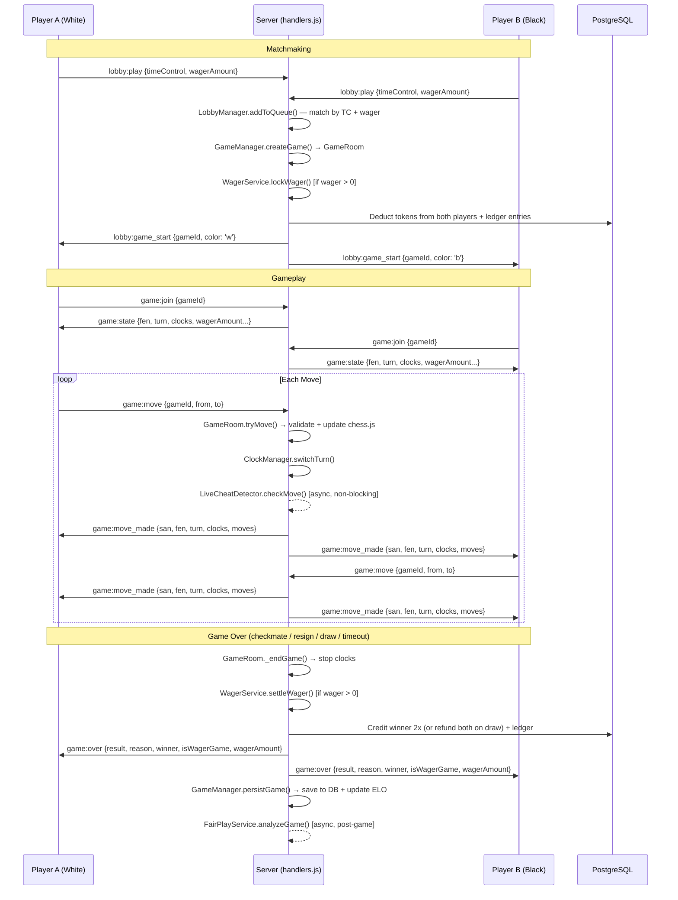
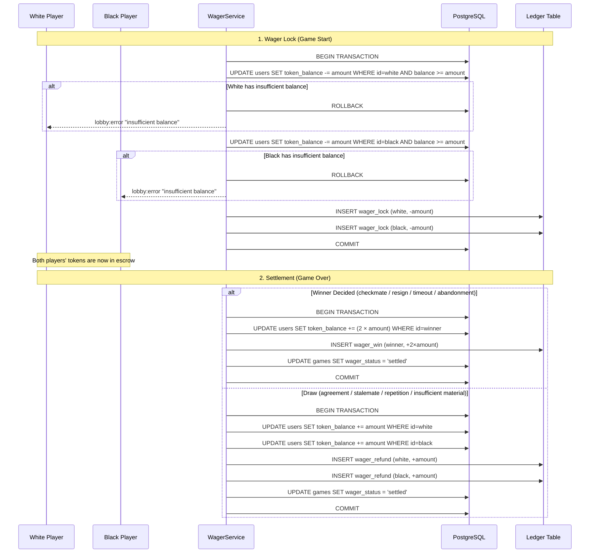
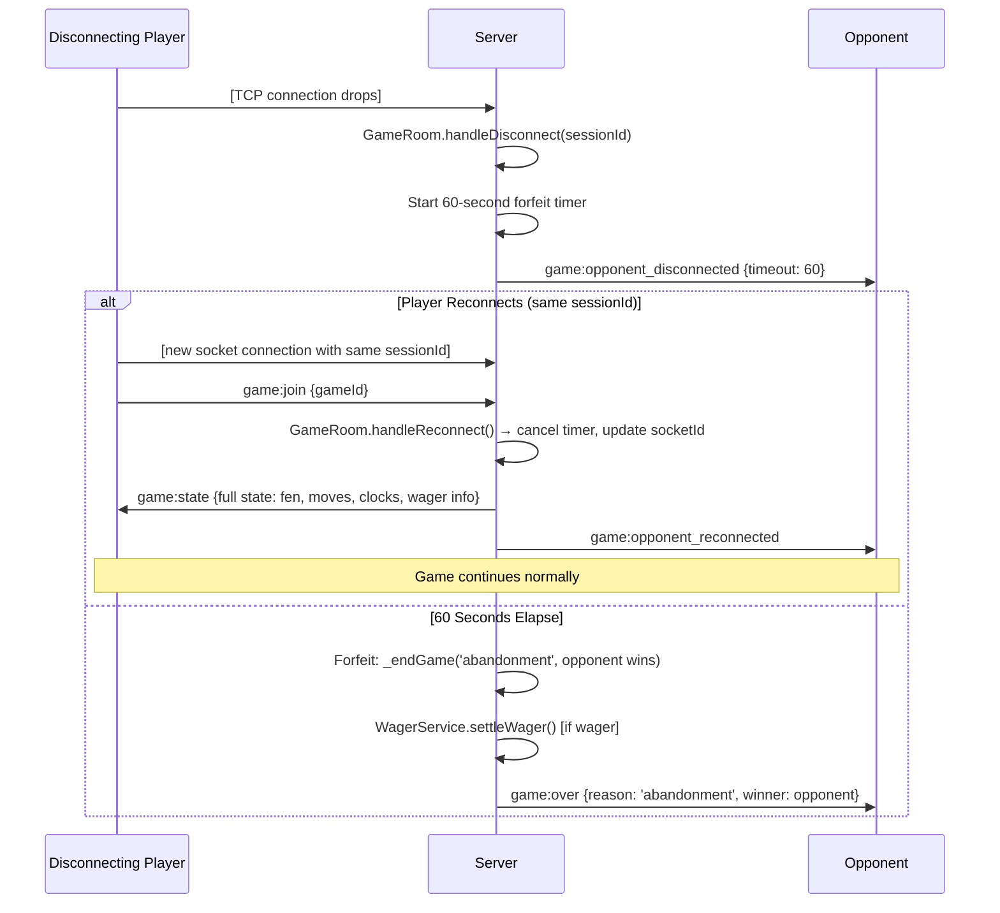
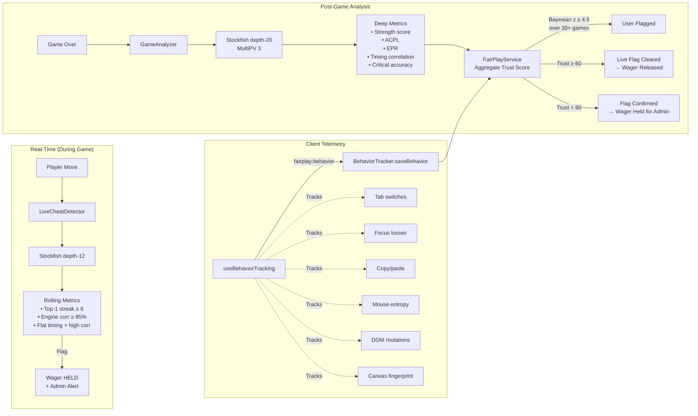
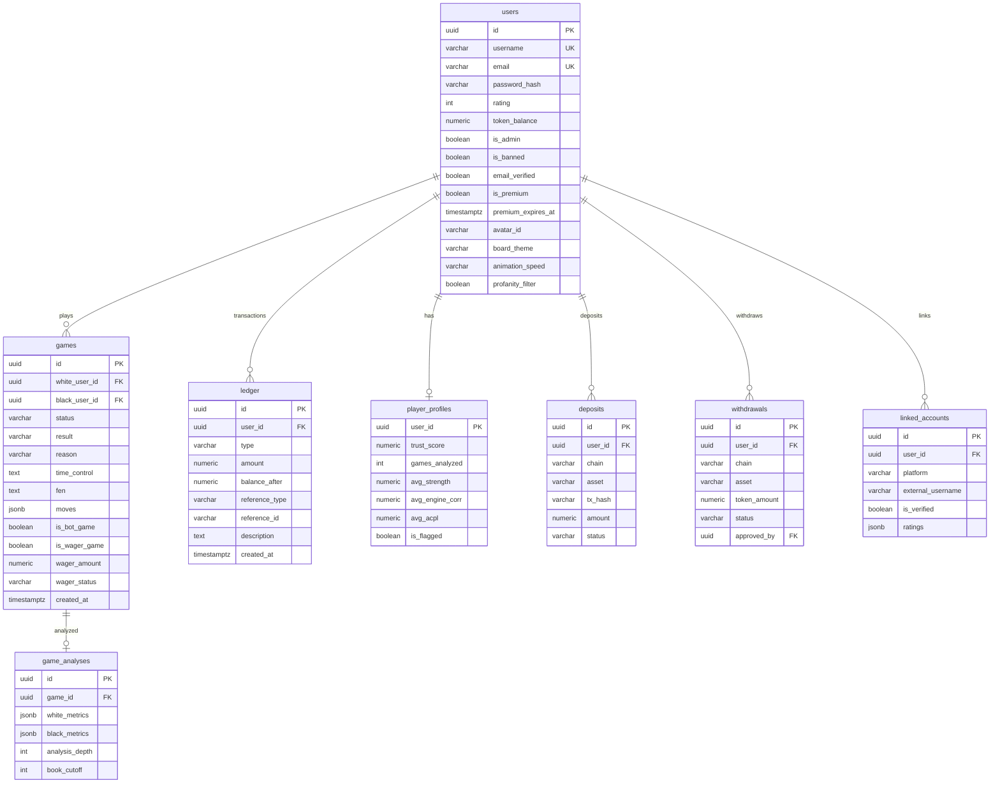

# ELO Stakes — Architecture

## High-Level System Overview

```mermaid
graph TB
    subgraph Client["Frontend (React + Vite)"]
        UI[React SPA<br/>elostakes.com]
        SC[Socket.IO Client]
        REST[HTTP / REST]
    end

    subgraph Server["Backend (Node.js + Express)"]
        IX[index.js<br/>Bootstrap & Wiring]
        SH[socket/handlers.js<br/>Real-Time Event Hub]

        subgraph Auth["Auth"]
            AS[authService.js<br/>JWT + bcrypt]
            AR[authRoutes.js<br/>Register / Login / Verify]
            AM[middleware.js<br/>authMiddleware / adminMiddleware]
        end

        subgraph GameEngine["Game Engine"]
            GM[GameManager<br/>Game Registry + Persistence]
            GR[GameRoom<br/>Board State + Clock + Chat]
            CM[ClockManager<br/>Per-Side Timers]
            LM[LobbyManager<br/>Matchmaking Queue]
        end

        subgraph BotSystem["Bot System"]
            BGM[BotGameManager<br/>Human vs Bot]
            BP[BotPlayer<br/>Move Generation]
            SE[StockfishEngine<br/>UCI WASM]
            PERS[botPersonalities.js<br/>6 Difficulty Levels]
        end

        subgraph WagerSystem["Wager & Escrow"]
            WS[WagerService<br/>Lock / Settle]
            GC[gateCheck.js<br/>Join Requirements]
        end

        subgraph CryptoSystem["Crypto Infrastructure"]
            WM[WalletManager<br/>HD Key Derivation]
            PS[PriceService<br/>CoinGecko Cache]
            DM[DepositMonitor<br/>ETH + SOL Polling]
            WP[WithdrawalProcessor<br/>Send Crypto]
            SM[SweepManager<br/>Fund Consolidation]
            CR[cryptoRoutes.js]
        end

        subgraph FairPlay["Anti-Cheat"]
            FPS[FairPlayService<br/>Orchestrator]
            GA[GameAnalyzer<br/>Post-Game Deep Analysis]
            AE[AnalysisEngine<br/>Stockfish MultiPV]
            LCD[LiveCheatDetector<br/>Real-Time Per-Move]
            BT[BehaviorTracker<br/>Client Telemetry]
        end

        subgraph Admin["Admin"]
            ADR[adminRoutes.js<br/>User / Game / Withdrawal Mgmt]
            BM[BotManager<br/>Stress Test Orchestrator]
        end

        subgraph Support["Supporting Services"]
            ES[emailService.js<br/>Resend API]
            LB[leaderboardRoutes.js]
            LA[linkedAccountRoutes.js<br/>Lichess OAuth + Chess.com]
            PR[premiumRoutes.js<br/>Subscriptions]
            PEC[PremiumExpiryChecker]
        end

        DB[(PostgreSQL)]
    end

    UI -->|WebSocket| SC
    SC <-->|socket.io| SH
    UI -->|fetch| REST
    REST --> AR
    REST --> CR
    REST --> LB
    REST --> LA
    REST --> PR
    REST --> ADR

    SH --> LM
    SH --> GM
    SH --> WS
    SH --> FPS
    SH --> BGM

    LM --> GM
    GM --> GR
    GR --> CM
    GM --> DB

    BGM --> BP
    BP --> SE
    BP --> GR

    WS --> DB
    GC --> DB

    FPS --> GA
    FPS --> LCD
    FPS --> BT
    FPS --> ES
    GA --> AE
    LCD --> AE
    FPS --> DB

    DM --> WM
    DM --> PS
    DM --> DB
    WP --> WM
    WP --> PS
    WP --> DB
    SM --> WM
    SM --> DB

    ADR --> BM
    ADR --> DB

    AR --> AS
    AR --> DB
    AR --> ES
    ADR --> AM

    PEC --> DB
    PR --> DB
```



## Game Lifecycle



## Wager Transaction Flow



## Disconnect & Reconnect Flow



## Anti-Cheat Pipeline



## Crypto Deposit / Withdrawal Flow

```mermaid
flowchart TB
    subgraph Deposit["Deposit Flow"]
        U1[User] -->|POST /deposit/address| ADDR[WalletManager<br/>HD Derive Address]
        ADDR --> QR[Show QR + Address]
        QR --> CHAIN[Blockchain<br/>ETH / SOL / USDC]
        CHAIN --> POLL[DepositMonitor<br/>30s polling]
        POLL -->|Detect TX| CONFIRM[Wait Confirmations<br/>ETH: 12 / SOL: 32]
        CONFIRM --> CREDIT[Credit token_balance<br/>USD 1:1 tokens]
        CREDIT --> EMAIL1[Deposit Receipt Email]
    end

    subgraph Withdrawal["Withdrawal Flow"]
        U2[User] -->|POST /withdraw| VALIDATE[Validate Address<br/>+ Balance Check]
        VALIDATE --> RAKE[Apply 3% Fee<br/>Premium: 0%]
        RAKE --> APPROVAL[Status: awaiting_approval]
        APPROVAL --> ADMIN[Admin Approve/Reject]
        ADMIN -->|Approve| PROCESS[WithdrawalProcessor<br/>Send on-chain TX]
        ADMIN -->|Reject| REFUND[Refund Tokens]
        PROCESS -->|Success| DONE[Status: confirmed]
        PROCESS -->|Failure| REFUND
    end

    subgraph Sweep["Fund Consolidation"]
        TIMER[5-min Interval] --> SM[SweepManager]
        SM --> MAIN[Sweep to Main Wallet<br/>ETH: keep gas / SOL: keep rent]
    end
```



## Database Schema (Key Tables)



## Directory Structure

```
chess-wager/
├── frontend/                    # React SPA (Vite)
│   └── src/
│       ├── components/          # 21 React components (board, timers, chat, modals, etc.)
│       ├── pages/               # 10 page components (Lobby, Game, Admin, Wallet, etc.)
│       ├── hooks/               # useGameSocket, useBehaviorTracking, useGameTabTitle
│       ├── context/             # AuthContext (global auth state)
│       ├── utils/               # avatars, board themes, profanity filter
│       ├── App.jsx              # Router + layout
│       ├── socket.js            # Socket.IO client singleton
│       └── main.jsx             # Entry point
├── backend/                     # Node.js + Express + Socket.IO
│   ├── src/
│   │   ├── admin/               # Admin routes + stress-test bot manager
│   │   ├── auth/                # JWT auth, middleware, routes
│   │   ├── bot/                 # Stockfish engine, personalities, bot player
│   │   ├── config/              # DB pool + migration runner
│   │   ├── crypto/              # HD wallets, deposit/withdrawal, price service
│   │   ├── email/               # Resend API email service
│   │   ├── fairplay/            # Anti-cheat: live detection, post-game analysis, Bayesian scoring
│   │   ├── game/                # GameManager, GameRoom, ClockManager
│   │   ├── leaderboard/         # Public player rankings + game history
│   │   ├── linkedAccounts/      # Lichess OAuth + Chess.com verification
│   │   ├── lobby/               # Matchmaking queue + pending games
│   │   ├── premium/             # Subscription management
│   │   ├── socket/              # handlers.js — central real-time event hub
│   │   ├── utils/               # ID generator, rate limiter
│   │   ├── wager/               # WagerService (escrow) + gate checks
│   │   └── index.js             # Server bootstrap
│   ├── migrations/              # 17 sequential SQL migrations
│   ├── tests/
│   │   ├── unit/                # Vitest unit tests
│   │   ├── e2e/                 # Vitest E2E tests (socket.io-based)
│   │   ├── integration/         # Integration tests
│   │   ├── helpers/             # Mock pool, mock services, test setup
│   │   └── production/          # Production smoke test script
│   └── scripts/                 # seedAdmin.js
├── scripts/                     # Kaggle fixture preparation
└── docker-compose.yml           # Local dev stack
```
